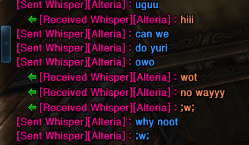

### **Intro**

Customize the color of whispers to your own desire based on context. All of this works clientsided. Nothing your client sends is changed.

#### Usage

1. Edit `settings.json` to colorize:
	* `me` - your whispers.
	* `friends` - your friends whispers.
	* `others` - other peoples whispers 
	* `particular` - name specific whispers.
	
**particular** target can be stated both with a **single string** or **array of strings**. You'll find examples inside if you have no idea what all of this means, just follow the syntax.

2. There's some commands below, most of them are just bloat.

*What's a hex color?? halp: https://www.hexcolortool.com/*

#### In-game Commands

* ***`cw`***  *`[on/off]`* turns on and off the whole module functionalities.
######
* ***`cw`*** *`[me/friends/others/particular]` `[on/off]`* turns on and off specific module functionalities.
######
* ***`cw`*** ***`color`*** *`#hexcolor`* just a command to test how colors actually look in-game.

#### Credits

* All the people i randomly whispered when testing.
* TerableCoder for the friend coloring.
* In general anyone working in tera-proxy that makes this possible.